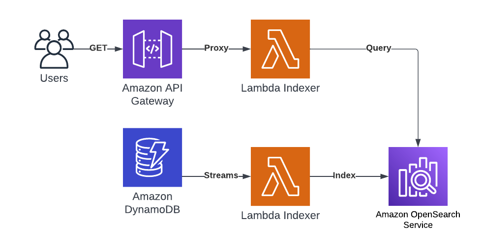
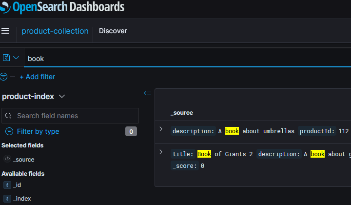
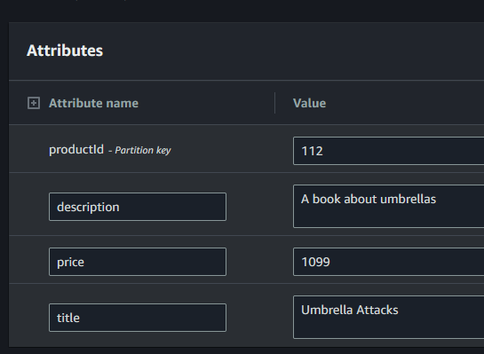
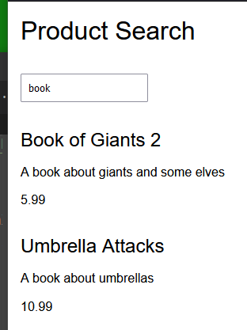

# Building with AWS OpenSearch Serverless
This repo contains a [CDK](https://aws.amazon.com/cdk/) application that deploys a stack with an [AWS OpenSearch Serverless](https://aws.amazon.com/opensearch-service/features/serverless/) application that is fed by a DynamoDB product database. There is a API Gateway with Lambda fronting OpenSearch for allowing people to do queries against the data.

The premise of this application was to explore the new (in preview at this time) OpenSearch Serverless application and deploy it in a realistic way to see how it works and evaluate the product.

## System Overview

## Deployment
If you have CDK installed globally then you can call `cdk` direct, if not you can use `npx cdk` - also see the [Getting started guide](https://docs.aws.amazon.com/cdk/v2/guide/getting_started.html).

1. Run npm install in the application directory.
2. Deploy with `cdk deploy --all`
3. Destroy with `cdk destroy --all`

**Beware, OpenSearch Serverless is not cheap so don't run it for very long!**

After deployment then you need to create an index. An Index cannot be created in the collection through CDK/CloudFormation - and rather than building something using a Custom Resource I added the index manually for this Spike:

* Once created then browse to the OpenSearch Service Console and go down to the Serverless menu.
* Select dashboard and launch the OpenSearch Dashboards URL
* Login with a valid access key
* In OpenSearch then browse to `Management` and `Dev Tools`
* On the left then enter `PUT product-index` and click run
* On the left menu, under `Management` choose `Stack Management`
* Click `Index Patterns`
* Click `Create index pattern`
* Type `product-index` in `Index pattern name`
* Click `Next step`
* Click `Create index pattern`

You can search in the Discover section when products are indexed:

## Add Products
Once the index exists then you can add products through DynamoDB:

* Browse to DynamoDB
* Choose `Explore items`
* Select the table with the prefix `AwsServerlessSearchStack-ProductCatalogueConstructProducts`
* Click `Create item`
* Enter a unique `productId`
* Click `Add new attribute` and add a string called `title` and give it a value
* Repeat for `description` and `price`
* Click `Create item`

At this point the stream should be processed by lambda and the item indexed in search within a second. You can also update rows and delete rows for that to be reflected in the index. Obviously you can import to DynamoDB, use APIs, etc as well.

## Try the API
In the [frontend](frontend) folder is a basic HTML page that you can run locally to test your API - you need to open the [index.html](frontend/index.html) file and update the API Gateway URL from your deployment.

